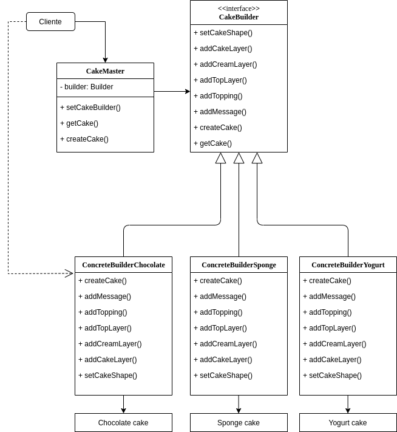

# Aula05 - Notes
#### EX1 - Food Service
How to run: 
- javac Lab05ex1.java 
- java Lab05ex1 
 
 
#### EX2 - Bakery
How to run: 
- javac Lab05ex2.java 
- java Lab05ex2 
 
 

Clean all the .class files:  
- rm *.class
 
 

You can follow the exercise using the following driagram:

